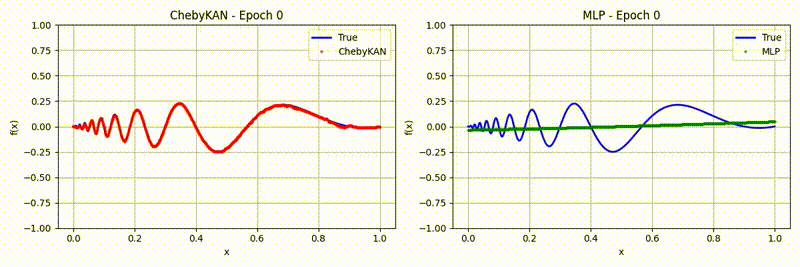

<div align="center">

# ChebyshevKAN vs MLP in Python and C 🥮
Comparing Chebyshev Polynomial Kolmogorov Arnold Networks to Multilayer Perceptrons on Nonlinear tasks

[](https://x.com/murage_kibicho)
[](https://leetarxiv.substack.com/p/chebyshev-kolmogorov-arnold-networks)


</div>

## Overview

[Complete writeup is available here](https://leetarxiv.substack.com/p/chebyshev-kolmogorov-arnold-networks)

Chebyshev Polynomials are sequences of polynomials defined on the interval [-1, 1]. 

Chebyshev polynomials possess these properties:
1. Orthogonality
2. Recursive definition
3. Inversion symmetry
4. Rapid Convergence and Uniform Approximation

TL;DR: Chebyshev polynomials can be used with einstein summations and are differentiable.

C example inference code is available in the folder C. Run with
```
clear && gcc Murage.c -lm -o m.o && ./m.o
```
Python notebooks are available in the folder Python.

Feel free to email me here: murage.kibicho@leetarxiv.com if you have questions.

You can also catch me on [Substack](https://leetarxiv.substack.com/p/chebyshev-kolmogorov-arnold-networks)
